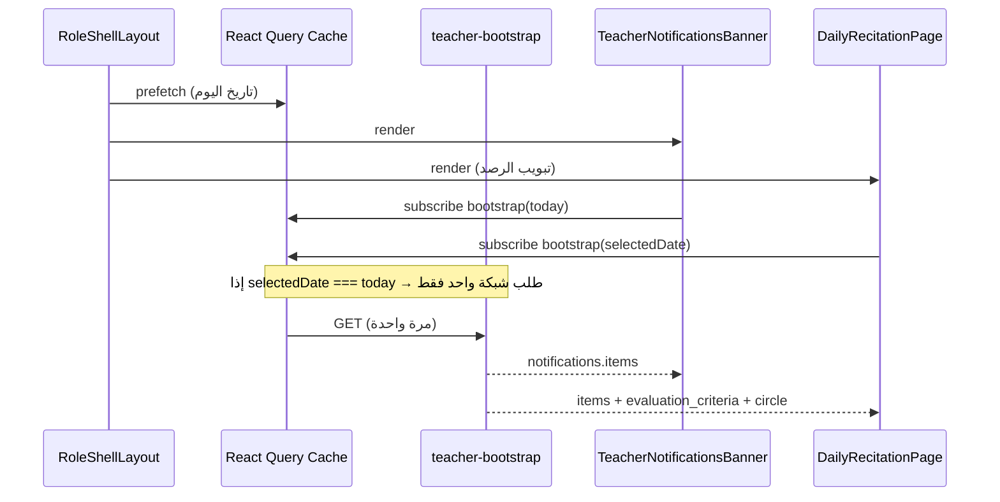

# ملخص للوكيل المسؤول عن التصميم — بوابة المعلم (Teacher Bootstrap)

> **الغرض:** توحيد تجربة بوابة المعلم بعد دمج طلبات الشبكة في استدعاء API واحد.  
> **الجمهور:** وكيل التصميم / UI — للحفاظ على تناسق المكونات والحالات البصرية.

---

## 1. ما الذي تغيّر (تقنياً لا بصرياً)

| قبل | بعد |
|-----|-----|
| 3–5 طلبات عند الدخول: `notifications` + `my-students` + (أحياناً `settings`) | **طلب واحد:** `GET /api/edu-dept/teacher-bootstrap?date=YYYY-MM-DD` |
| كل مكوّن يجلب بياناته منفصلاً | **React Query cache مشترك** — نفس المفتاح `["edu-dept","teacher-bootstrap", date]` |

**لا تغييرات تصميم مطلوبة** للمكونات الحالية ما لم تُطلب تحسينات UX جديدة. الهيكل البصري (بوابة المعلم، الرصد، البanner) يبقى كما هو.

---

## 2. تدفق البيانات (للتنسيق بين الشاشات)



---

## 3. المكونات المتأثرة

| المكوّن | المسار | السلوك |
|---------|--------|--------|
| `RoleShellLayout` | `layouts/RoleShellLayout.tsx` | prefetch للمعلم عند mount |
| `TeacherNotificationsBanner` | `components/edu/TeacherNotificationsBanner.tsx` | المعلم: من cache bootstrap؛ مشرف المسار: `notifications` المنفصل |
| `DailyRecitationPage` | `pages/edu-dept/DailyRecitationPage.tsx` | المعلم: bootstrap بدل `my-students` |
| `TeacherHubPage` | `pages/teacher/TeacherHubPage.tsx` | بدون تعديل — يستخدم `RecitationHubShell` + `DailyRecitationPage embedded` |
| `RecitationHubShell` | `components/edu/RecitationHubShell.tsx` | `forceMount` على التبويبات — لا إعادة fetch عند التنقل بين التبويبات (نفس جلسة cache) |

---

## 4. حالات الواجهة (يجب الإبقاء عليها)

- **تحميل الرصد:** `RecitationTableSkeleton` — لا تغيير.
- **بanner الإشعارات:** `ds.alert.success` — بطاقة خضراء، زر إخفاء (X).
- **لا حلقة للمعلم:** رسالة خطأ من API (`لم يتم ربط حلقة`) — نفس النص الحالي.
- **تغيير تاريخ الرصد:** يُعيد جلب bootstrap للتاريخ الجديد فقط (مفتاح cache مختلف). الإشعارات تبقى من bootstrap **تاريخ اليوم** في الـ banner.

---

## 5. عقد API (للتصميم المستقبلي)

```json
{
  "generated_at": "ISO",
  "date": "YYYY-MM-DD",
  "teacher_circle": { "id": 1, "name_ar": "..." },
  "circle_id": 1,
  "circle_name": "...",
  "circles": [{ "id": 1, "name_ar": "..." }],
  "needs_circle_selection": false,
  "evaluation_criteria": [ /* معايير الرصد */ ],
  "items": [ /* طلاب + task_scores + حضور */ ],
  "notifications": { "items": [ /* غير مقروءة */ ] }
}
```

**تبويب «خطة الفصل»** (`SemesterPlanPlaceholder`): placeholder جاهز — عند التصميم، يُفضّل جلب خطط من endpoint مستقبلي أو توسيع bootstrap **دون** إعادة waterfall (ناقش مع Backend).

**تبويب «منافسات الحلقة»:** ما زال `teacher-competitions` منفصلاً — مقصود (بيانات ثقيلة عند الطلب فقط).

---

## 6. توكنات التصميم (design-system)

استمر في استخدام:

- `ds.pageShell`, `ds.page.title`, `ds.page.description` — رأس البوابة
- `ds.hubTabsList`, `ds.hubTabTrigger`, `ds.hubBottomNav` — تنقل التبويبات
- `ds.card`, `ds.alert.success` — بطاقات وإشعارات
- `tajawal` — كل النصوص العربية

---

## 7. مهام تصميم مقترحة (اختيارية — لاحقاً)

1. **Skeleton موحّد للبوابة** — shimmer يغطي banner + جدول الرصد أثناء bootstrap الأول.
2. **حالة «آخر تحديث»** — عرض `generated_at` بشكل خفيف تحت عنوان الحلقة (offline-friendly).
3. **تبويب خطة الفصل** — استبدال placeholder بتصميم بطاقات طالب / أهداف أسبوعية.
4. **تقارير ومتابعة الطلاب** — ستستخدم مجاميع `metrics_json` من Backend (`fetchStudentCompetitionMetricsTotals`) — جداول KPI + sparklines.

---

## 8. ملفات مرجعية للمطور/المصمم

| ملف | دور |
|-----|-----|
| `apps/web/src/app/lib/teacher-bootstrap.ts` | أنواع + تحويل payload |
| `apps/web/src/app/hooks/use-teacher-bootstrap.ts` | hook + prefetch + invalidate |
| `apps/web/src/app/lib/query-keys.ts` | `teacherBootstrap(date)` |
| `apps/api/src/routes/edu-dept-core.ts` | handler `GET /api/edu-dept/teacher-bootstrap` |

---

## 9. قيود يجب احترامها

- **عدم تغيير** أسماء props للمكونات المدمجة (`DailyRecitationPage embedded`, `RecitationHubShell`).
- **مشرف المسار** (`track_supervisor`) — **لا** يستخدم bootstrap؛ يبقى على `my-students` + `filter-scopes`.
- **الطباعة:** `print:hidden` على banner الإشعارات — كما هو.

---

*آخر تحديث: بعد ربط الواجهة بـ teacher-bootstrap على `main`.*
