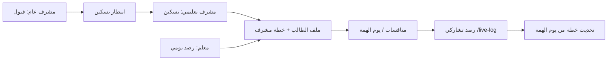

# أمثلة التطوير — منصة بساتين

دليل سيناريوهات المعاينة والبيانات التجريبية للمشرف التعليمي (والاعتماديات مع المشرف العام والمعلم).

## 1. تفعيل وضع المعاينة (بدون Worker)

في `apps/web/.env.development.local`:

```env
VITE_UI_DEV=true
```

ثم:

```powershell
cd apps/web
npm run dev
```

الدخول بأي جوال من الجدول أدناه — الـ API يُحاكى من `dev-preview-mocks.ts` + `dev-preview-fixtures.ts`.

## 2. بيئة API محلية (D1 + Worker)

```powershell
cd apps/api
npm run db:local:all
npm run dev
```

في نافذة أخرى:

```powershell
cd apps/api
npm run seed:local
curl -X POST "http://127.0.0.1:8787/api/setup/seed-edu-examples?key=basateen-setup-once"
```

أو:

```powershell
npm run db:local:018
```

## 3. حسابات تجريبية

| الجوال | الدور | مسار البداية |
|--------|------|--------------|
| 0500000001 | مدير عام | `/admin/staff` |
| 0500000002 | مشرف تعليمي (نطاق ابتدائي) | `/edu-supervisor/dashboard` |
| 0500000003 | مشرف برامج | `/prog-supervisor` |
| 0500000004 | مشرف عام | `/general-supervisor/student-attendance` |
| 0500000005 | معلم | `/teacher` |

كلمة مرور API (بعد `seed-users`): `Basateen123!`

## 4. سلسلة الاعتماديات (Edu)



| الخطوة | شاشة | بيانات المثال |
|--------|------|----------------|
| قبول | GS → قبول وتسجيل | طلب معلّق + قبول → `pending_placement` |
| تسكين | `/edu-supervisor/placement` | طالب 2، 9 بدون حلقة |
| ملف + خطة | `/edu-supervisor/students/1` | خطة حفظ/مراجعة/سماع + رصد معلم 7 أيام |
| منافسة سرد | `/edu-supervisor/competitions/1` | توزيع `distributed_json` |
| منافسة مكثف | `/edu-supervisor/competitions/2` | `competition_logs` (معزولة عن `teacher_daily_marks`) |
| يوم الهمة | `/edu-supervisor/yom-himma` | جلسة حية + شهادات + «تحديث الخطة» |
| رصد ميداني | `/live-log/:token` | انظر الجدول التالي |

## 5. روابط الرصد التشاركي (ثابتة بعد seed-edu-examples)

| الفعالية | Token | URL |
|----------|-------|-----|
| يوم الهمة | `demo-himma-live` | `/live-log/demo-himma-live` |
| سرد ممتد | `demo-comp-extended` | `/live-log/demo-comp-extended` |
| برنامج مكثف | `demo-comp-intensive` | `/live-log/demo-comp-intensive` |

## 6. أمثلة الرصد

| النوع | الجدول | لا يكتب في |
|-------|--------|------------|
| رصد المعلم اليومي | `teacher_daily_marks` | — |
| رصد يوم الهمة | `yom_himma_audit` | `teacher_daily_marks` |
| رصد المنافسة المكثفة | `competition_logs` | `teacher_daily_marks` |
| خطة المشرف | `student_edu_plans` | تراكمي — لا يستبدل سجل المعلم |

بعد يوم الهمة: زر **تحديث خطة الطالب** يدمج `hizb_done` / `juz_done` في `student_edu_plans`.

## 7. مسار التالي (خارطة الطريق)

1. **مشرف عام** — إكمال الشاشات والأمثلة على نفس النمط.
2. **معلم** — رصد يومي، خطط الفصل، ربط الحضور التلقائي.
3. **إنتاج** — `db:remote:*`، `seed` على البيئة البعيدة، نشر Worker + Pages، `VITE_UI_DEV=false`.
